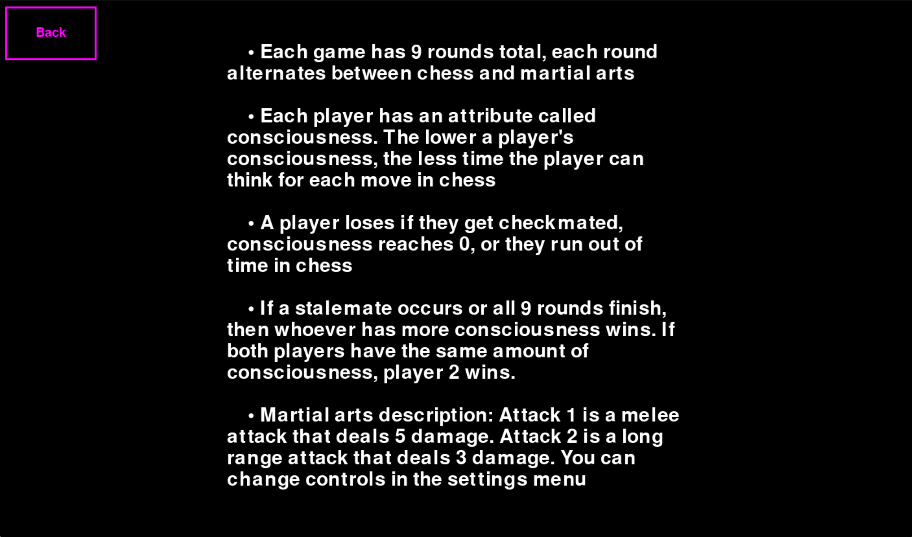

# ChessFighting

This is a game inspired by the sport Chessboxing. The players alternate between playing chess and 2D fighter games. First player to get checkmated or die in the fighter loses

## Play the game

Two versions of the game were made, one in python and the other in godot. For python, simply run main.py. For Godot, download godot and load the project. Make sure *Scenes/StartScene.tscn* is the main scene and run the game.

